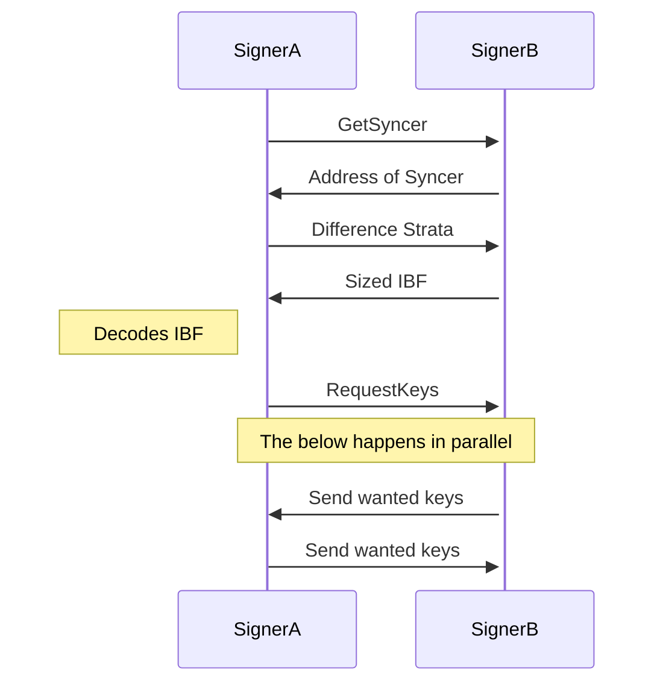
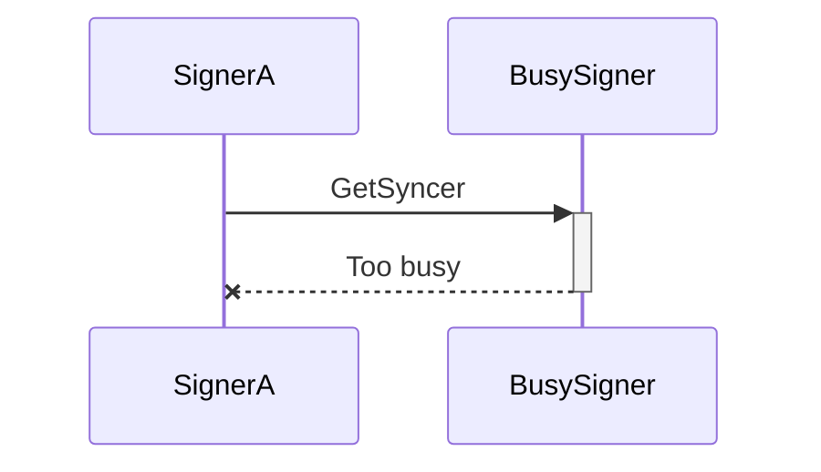
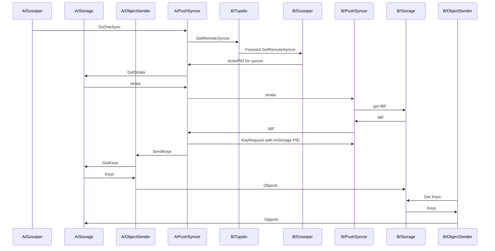
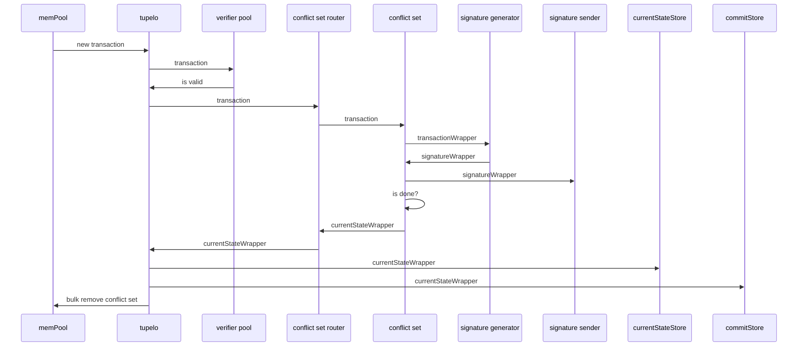
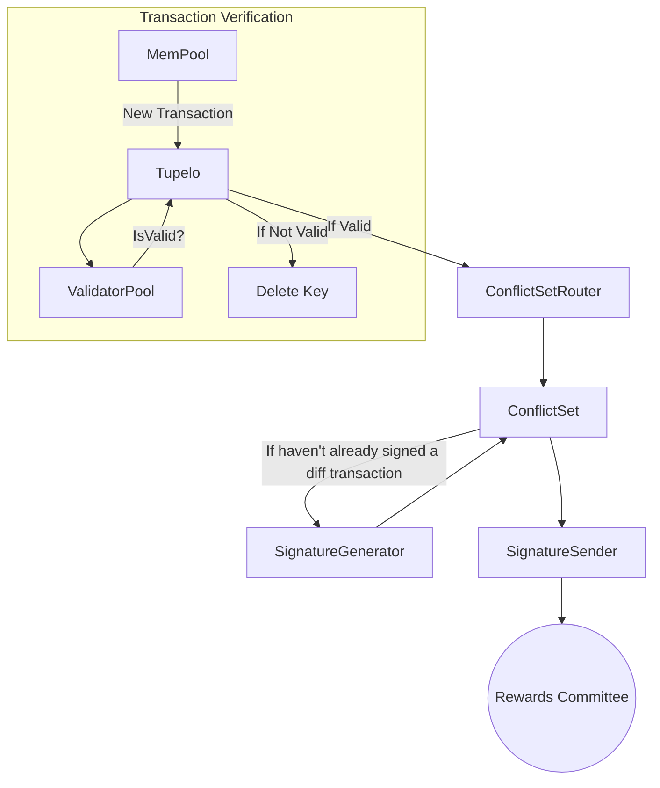
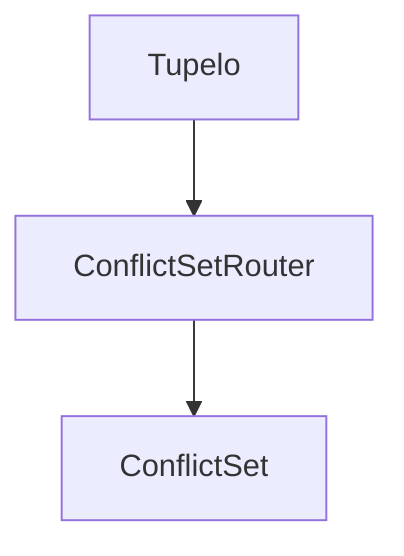
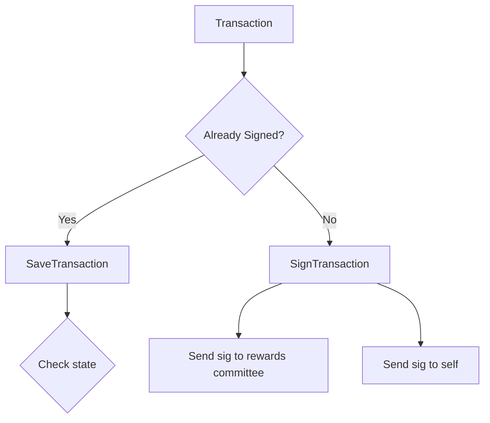
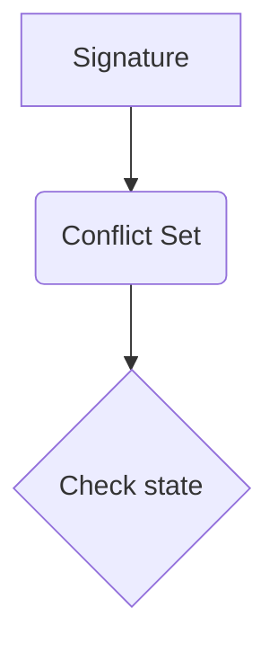
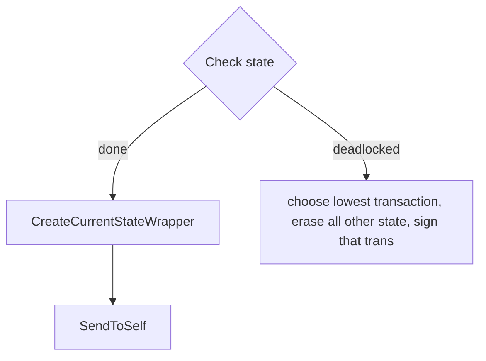
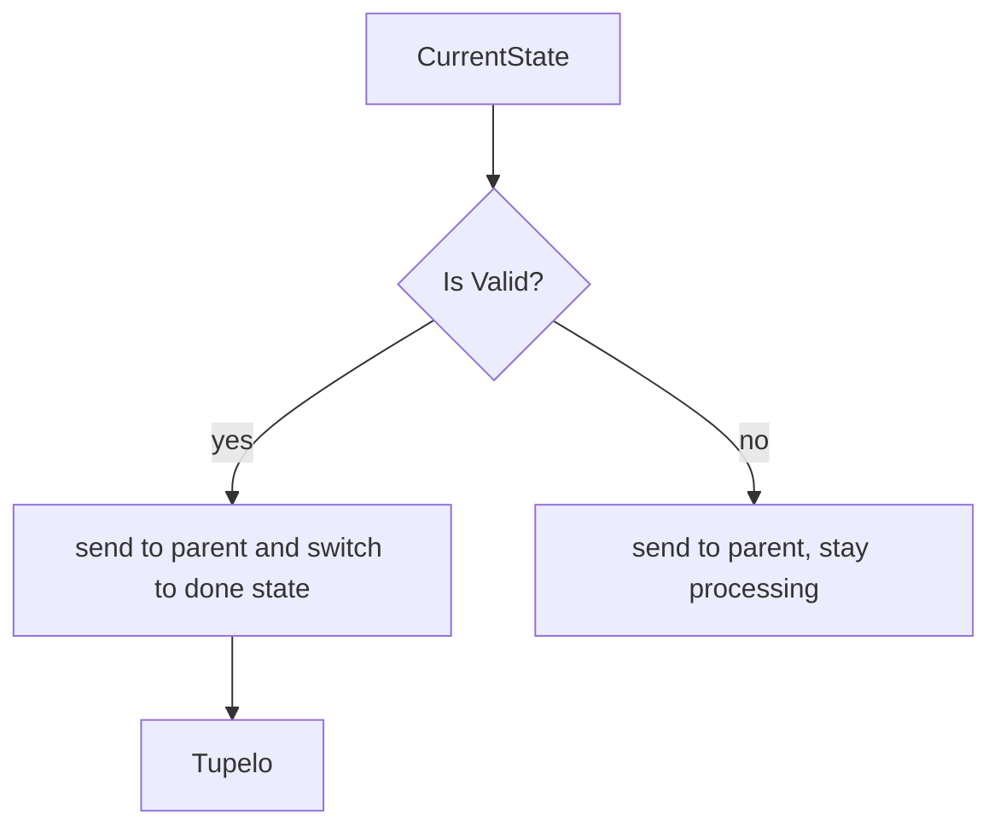

# Gossip3

## Sync

### High level

### When too busy

### With actors

## Actor Communication
### A valid transaction with no flaws

## New Transaction

## New Signature

## ConflictSet logic
### New Transaction

### New Signature

### Check State

### Current State Wrapper

